# FluidTouch User Interface Guide

> Comprehensive walkthrough of the FluidTouch interface with screenshots

## Table of Contents

- [Startup](#startup)
- [Machine Selection](#machine-selection)
- [Main Interface](#main-interface)
  - [Status Bar](#status-bar)
  - [Tab Navigation](#tab-navigation)
- [Status Tab](#status-tab)
- [Control Tab](#control-tab)
  - [Actions](#actions)
  - [Jog](#jog)
  - [Joystick](#joystick)
  - [Probe](#probe)
  - [Overrides](#overrides)
- [Files Tab](#files-tab)
- [Macros Tab](#macros-tab)
- [Terminal Tab](#terminal-tab)
- [Settings Tab](#settings-tab)
  - [General](#general)
  - [Jog](#jog-settings)
  - [Probe](#probe-settings)
  - [About](#about)

---

## Startup

### Splash Screen

On startup, FluidTouch displays a splash screen before proceeding to machine selection.

---

## Machine Selection

The machine selection screen allows you to:
- **Select** from up to 4 saved machine configurations
- **Reorder** machines using up/down buttons
- **Edit** existing machine configurations
- **Delete** machines you no longer need
- **Add** new machines (green button in upper right)

Each machine configuration stores:
- Machine name
- Connection (currently only Wireless is supported)
- FluidNC IP address
- WebSocket port (default: 81)

---

## Main Interface

### Status Bar

The status bar at the top displays:

**Left Section** (clickable - navigates to Status tab):
- Machine state: IDLE, RUN, JOG, HOLD, ALARM, etc.
- Color-coded for quick recognition

**Center Section**:
- Work Position (WPos) - Orange labels
- Machine Position (MPos) - Cyan labels
- Format: X/Y/Z coordinates with axis-specific colors

**Right Section** (clickable - restart to switch machines):
- Machine name with connection symbol (top line, blue)
- WiFi network name (bottom line, cyan)

### State Popups

**HOLD Popup:**
- Appears when machine enters HOLD state
- Shows last FluidNC message
- Buttons: "Close" (dismiss) and "Resume" (send cycle start)

**ALARM Popup:**
- Appears when machine enters ALARM state
- Shows alarm message
- Buttons: "Close" (dismiss) and "Clear Alarm" (reset + unlock)

---

## Status Tab

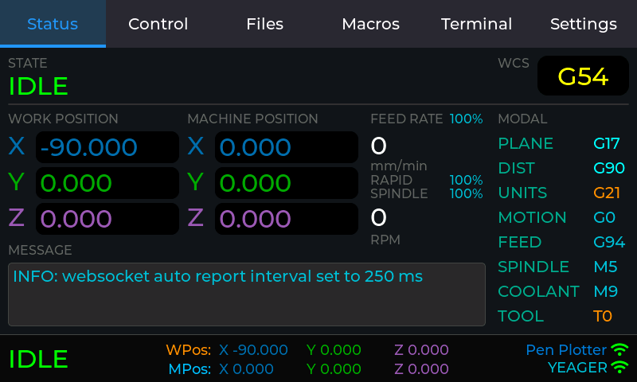

Real-time machine status display with four columns:

**Column 1 - Work Position:**
- X, Y, Z coordinates in work coordinate system
- Orange axis labels

**Column 2 - Machine Position:**
- X, Y, Z coordinates in machine coordinate system
- Cyan axis labels

**Column 3 - Rates:**
- Feed Rate with override percentage
- Spindle Speed with override percentage

**Column 4 - Modal States:**
- Work Coordinate System (G54-G59)
- Plane (G17/G18/G19)
- Distance Mode (G90/G91)
- Units (G20/G21)
- Motion Mode (G0/G1/G2/G3)
- Feed Mode (G93/G94)
- Spindle State (M3/M4/M5)
- Coolant (M7/M8/M9)
- Tool Number

**SD Card File Progress** (when printing):
- Filename (truncated to fit)
- Progress bar (0-100%)
- Elapsed time (H:MM format)
- Estimated completion time

**Message Display:**
- Last FluidNC message
- Spans columns 1-3 at bottom

---

## Control Tab

The Control tab contains five sub-tabs for different control operations:

### Actions

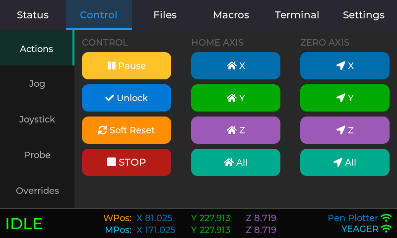

Machine control buttons:
- **Home All** - Execute homing cycle ($H)
- **Home X/Y/Z** - Home individual axes
- **Zero All** - Zero all work coordinates (G10 L20 P0 X0 Y0 Z0)
- **Zero X/Y/Z** - Zero individual work coordinates
- **Unlock** - Clear alarm state ($X)
- **Reset** - Soft reset (Ctrl+X)

### Jog

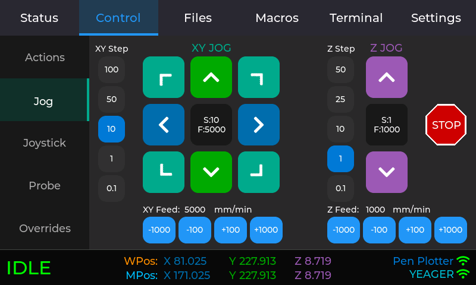

Button-based jogging interface:

**XY Section (Left):**
- Step selection buttons: 100, 50, 10, 1, 0.1 mm
- 3×3 jog pad with diagonal movements
- Axis-colored buttons (XY=cyan, Y=green, X=cyan)
- Feed rate controls (±100, ±1000 mm/min)
- Stop button

**Z Section (Right):**
- Step selection buttons: 50, 25, 10, 1, 0.1 mm
- Z+ / Z- buttons (magenta)
- Feed rate controls
- Stop button

### Joystick

Analog-style jogging:

**XY Joystick:**
- 220×220 pixel circular pad
- Draggable knob with crosshairs
- Quadratic response curve for fine control

**Z Slider:**
- 80×220 pixel vertical slider
- Draggable knob
- Quadratic response curve

**Info Display:**
- Current percentage (X/Y/Z)
- Feed rate (mm/min)
- Max feed rate from settings

### Probe

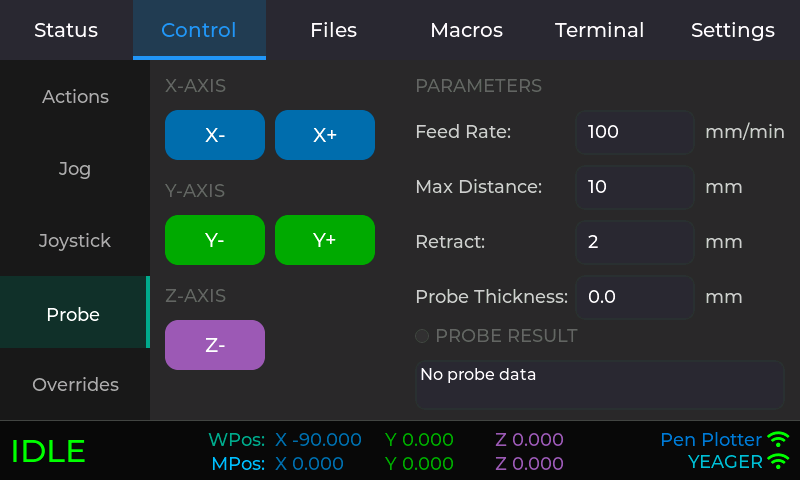

Touch probe operations:

**Probe Buttons:**
- X-, Y-, Z- directions (axis-colored)
- Z- only for standard touch probe

**Parameters:**
- Feed Rate (mm/min)
- Max Distance (mm)
- Retract (mm)
- Probe Thickness (mm)

**Results Display:**
- Two-line result textarea
- Shows probed axis value
- Success/failure message

### Overrides

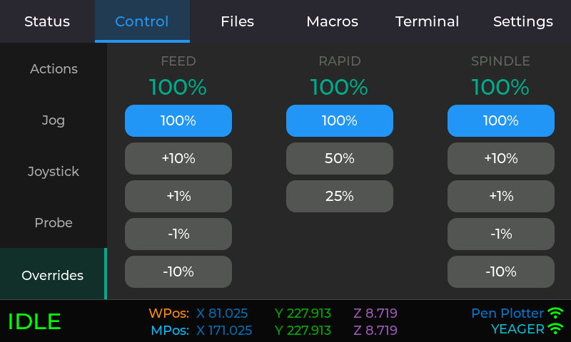

Real-time override controls:
- **Feed Override** - 10-200% (±10%, ±1%, Reset 100%)
- **Rapid Override** - 25/50/100% (preset buttons)
- **Spindle Override** - 10-200% (±10%, ±1%, Reset 100%)

---

## Files Tab

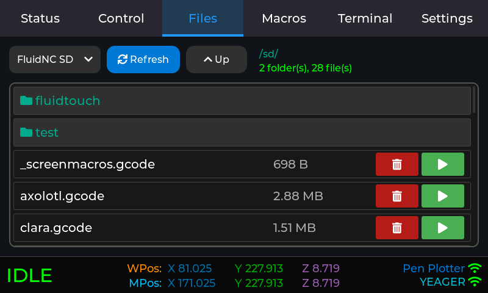

List and manage files on the SD card and flash memory of the FluidNC controller.

---

## Macros Tab

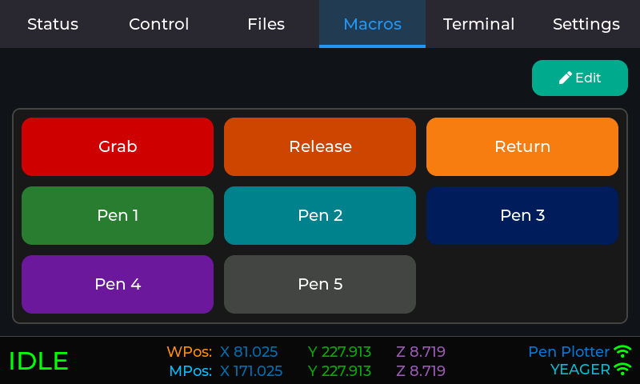

Store up to 9 file-based macros with Name, filename (selectable from dropdown of existing files in /sd/FluidTouch/Macros), and a color.

---

## Terminal Tab

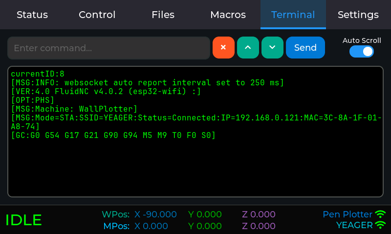

Raw WebSocket message display:
- Live message stream from FluidNC
- Auto-scroll toggle
- Excludes messages such as status updates to prevent performance issues.

---

## Settings Tab

The Settings tab contains four sub-tabs for configuration:

### General

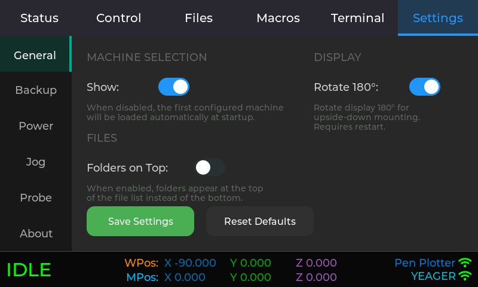

Machine Selection:
- Whether or not to show the machine selection screen.  If skipped, it will automatically load the configuration for the first machine.

### Jog Settings

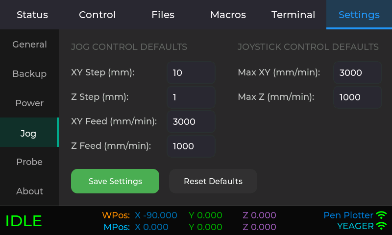

Jogging preferences:
- XY Max Feed Rate (mm/min)
- Z Max Feed Rate (mm/min)
- Default step sizes

### Probe Settings

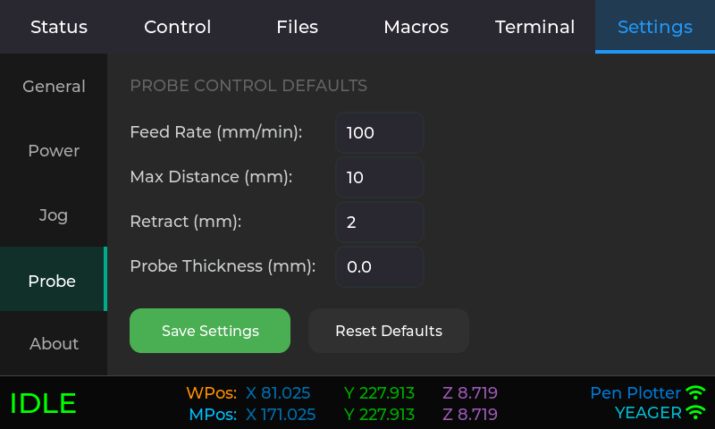

Probe operation defaults:
- Feed Rate (mm/min)
- Max Distance (mm)
- Retract Distance (mm)
- Probe Thickness (mm)

### About

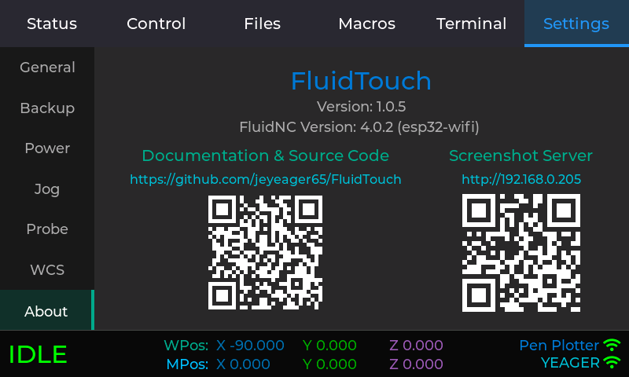

Project information:
- FluidTouch version
- GitHub link with QR code
- Screenshot server link with QR code

**GitHub QR Code:**
- Points to repository

**Screenshot Server QR Code:**
- Appears when WiFi connects
- Shows http://[IP] URL

---

## Navigation Tips

- **Tap status bar left** - Jump to Status tab
- **Tap status bar right** - Restart to switch machines
- **State popups** - Auto-dismiss when state changes
- **QR codes** - Scan with phone camera for quick links
- **Position displays** - Updated every 250ms from FluidNC

---

*For detailed operating instructions, see [Usage Guide](./usage.md)*
