# FluidTouch User Interface Guide

> Comprehensive walkthrough of the FluidTouch interface with screenshots

## Table of Contents

- [Startup](#startup)
- [Machine Selection](#machine-selection)
- [Main Interface](#main-interface)
  - [Status Bar](#status-bar)
  - [Tab Navigation](#tab-navigation)
- [Status Tab](#status-tab)
- [Control Tab](#control-tab)
  - [Actions](#actions)
  - [Jog](#jog)
  - [Joystick](#joystick)
  - [Probe](#probe)
  - [Overrides](#overrides)
- [Files Tab](#files-tab)
- [Macros Tab](#macros-tab)
- [Terminal Tab](#terminal-tab)
- [Settings Tab](#settings-tab)
  - [General](#general)
  - [Jog](#jog-settings)
  - [Probe](#probe-settings)
  - [Power](#power-settings)
  - [About](#about)

---

## Startup

### Splash Screen

On startup, FluidTouch displays a splash screen before proceeding to machine selection.

---

## Machine Selection

The machine selection screen appears after the splash screen when you first power on FluidTouch. It displays all configured machines (up to 4) with their names, WiFi networks, and connection status. Tap any machine to connect.

If no machines are configured, you'll see a prompt to add your first machine.

Each machine configuration stores:
- Machine name
- Connection type (currently only Wireless is supported)
- WiFi SSID and password
- FluidNC IP address or hostname
- WebSocket port (default: 81)

### Machine Selection Edit Mode

Clicking the "Edit" button enters edit mode, which allows you to reorder, edit, or delete machines:

- **Layout**: Machine buttons (458px wide) on the left, control buttons (60×60px) on the right
- **Control buttons**: Up/down arrows for reordering, edit (✏️) for configuration, delete (🗑️) for removal
- **Add button**: Green "➕ Add" button (120×45px) in upper right corner appears in edit mode
- **Spacing**: Consistent 5px gaps between all elements (matches macro list spacing)
- **Workflow**: Manage → configure slots → tap machine to exit edit mode and connect

### Machine Add/Edit Dialog

Modal dialog for adding or editing machine configurations:

**Left Column (64% width):**
- **Name:** Machine identifier (32 characters max)
- **SSID:** WiFi network name
- **FluidNC URL:** IP address or hostname (e.g., 192.168.1.100 or fluidnc.local)

**Right Column (33% width):**
- **Connection:** Wireless (only option currently)
- **Password:** WiFi password
- **Port:** WebSocket port (default: 81)

**Buttons:**
- **Save** (bottom left) - Save configuration
- **Cancel** (bottom right) - Discard changes

---

## Main Interface

### Status Bar

The status bar at the top displays:

**Left Section** (clickable - navigates to Status tab):
- Machine state: IDLE, RUN, JOG, HOLD, ALARM, etc.
- Color-coded for quick recognition

**Center Section**:
- Work Position (WPos) - Orange labels
- Machine Position (MPos) - Cyan labels
- Format: X/Y/Z coordinates with axis-specific colors

**Right Section** (clickable - restart to switch machines):
- Machine name with connection symbol (top line, blue)
- WiFi network name (bottom line, cyan)

---

## Status Tab

Real-time machine status display with four columns:

**Column 1 - Work Position:**
- X, Y, Z coordinates in work coordinate system

**Column 2 - Machine Position:**
- X, Y, Z coordinates in machine coordinate system

**Column 3 - Rates:**
- Feed Rate with override percentage
- Spindle Speed with override percentage

**Column 4 - Modal States:**
- Work Coordinate System (G54-G59)
- Plane (G17/G18/G19)
- Distance Mode (G90/G91)
- Units (G20/G21)
- Motion Mode (G0/G1/G2/G3)
- Feed Mode (G93/G94)
- Spindle State (M3/M4/M5)
- Coolant (M7/M8/M9)
- Tool Number

**SD Card File Progress** (when printing):

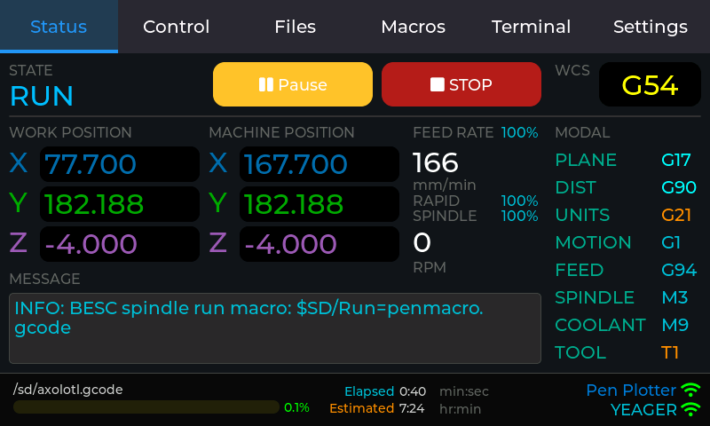

- Filename (truncated to fit)
- Progress bar (0-100%)
- Elapsed time (H:MM format)
- Estimated completion time

**Message Display:**
- Last FluidNC message
- Spans columns 1-3 at bottom

---

## Control Tab

The Control tab contains five sub-tabs for different control operations:

### Actions

Machine control buttons:
- **Home All** - Execute homing cycle ($H)
- **Home X/Y/Z** - Home individual axes
- **Zero All** - Zero all work coordinates (G10 L20 P0 X0 Y0 Z0)
- **Zero X/Y/Z** - Zero individual work coordinates
- **Unlock** - Clear alarm state ($X)
- **Reset** - Soft reset (Ctrl+X)

### Jog

Button-based jogging interface:

**XY Section (Left):**
- Step selection buttons: 100, 50, 10, 1, 0.1 mm
- 3×3 jog pad with diagonal movements
- Axis-colored buttons (XY=cyan, Y=green, X=cyan)
- Feed rate controls (±100, ±1000 mm/min)
- Stop button

**Z Section (Right):**
- Step selection buttons: 50, 25, 10, 1, 0.1 mm
- Z+ / Z- buttons (magenta)
- Feed rate controls
- Stop button (Jog Cancel)

### Joystick

Analog-style jogging with multiple axis selection modes:

**XY Mode** - Simultaneous XY movement:

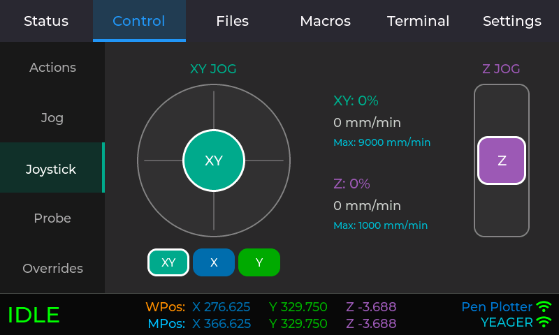

- 220×220 pixel circular pad
- Draggable knob with crosshairs
- Quadratic response curve for fine control

**XYZ Mode** - All three axes:

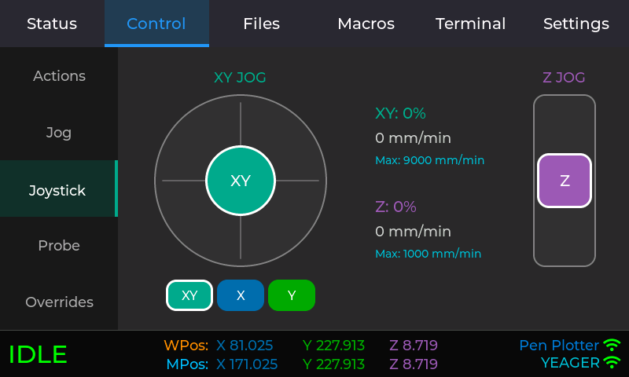

- Circular XY pad with Z slider
- Independent control of all axes
- Z slider on right side (80×220 pixels)

**XZ Mode** - X and Z axes:

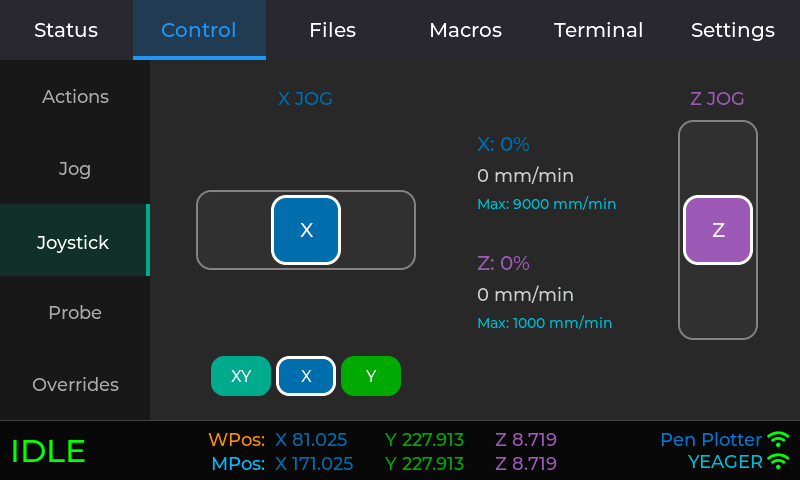

- Horizontal X slider
- Vertical Z slider
- Useful for face operations

**YZ Mode** - Y and Z axes:

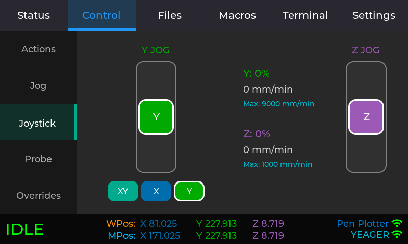

- Horizontal Y slider
- Vertical Z slider
- Useful for side operations

**Common Features:**
- Mode buttons below joystick with white border on selected mode
- Quadratic response curve for precise control near center
- Info display shows: current percentage (X/Y/Z), feed rate (mm/min), max feed rate from settings

### Probe

Touch probe operations:

**Probe Buttons:**
- X-, Y-, Z- directions (axis-colored)
- Z- only for standard touch probe

**Parameters:**
- Feed Rate (mm/min)
- Max Distance (mm)
- Retract (mm)
- Probe Thickness (mm)

**Results Display:**
- Two-line result textarea
- Shows probed axis value
- Success/failure message

### Overrides

Real-time override controls:
- **Feed Override** - 10-200% (±10%, ±1%, Reset 100%)
- **Rapid Override** - 25/50/100% (preset buttons)
- **Spindle Override** - 10-200% (±10%, ±1%, Reset 100%)

---

## Files Tab

Browse and manage files on FluidNC SD card and flash storage:

**Features:**
- Navigate folders (tap to open)
- View file sizes
- Play files (GCode programs)
- Upload files from browser
- Delete files and folders

**File List:**
- Shows folders and files from current directory
- Folders appear first (if "Folders on Top" enabled)
- File sizes displayed for files
- Back button to navigate to parent directory

### File Upload Dialog

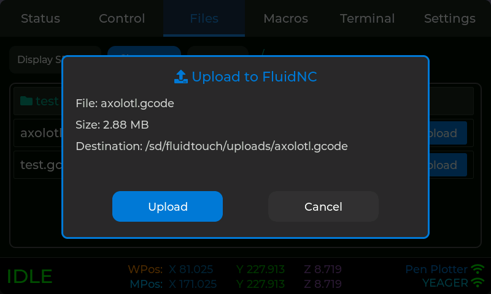

Modal dialog for uploading files to FluidNC:

**Steps:**
1. Tap "Upload" button in Files tab
2. Dialog shows current directory path
3. Displays web URL with QR code
4. Open URL in browser on computer/phone
5. Select file to upload
6. Progress bar shows upload status
7. File appears in file list when complete

**Upload Progress:**
- Shows current/total bytes transferred
- Percentage complete
- Progress bar visual
- "Reset device to cancel upload" during transfer
- "Close" button after completion

### Delete Confirmation

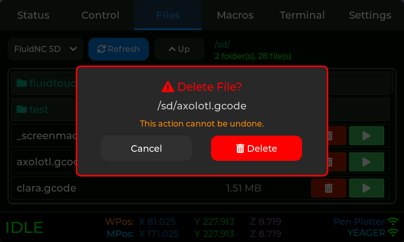

Confirmation dialog before deleting files:
- Shows filename to be deleted
- "Delete" button (red) - Confirm deletion
- "Cancel" button (gray) - Abort operation

---

## Macros Tab

Store and execute up to 9 file-based macros:

**Normal Mode:**
- 3×3 grid of macro buttons
- Tap to execute macro file
- Color-coded for quick identification
- Empty slots show "Empty"
- Gear icon (upper right) to enter edit mode

### Macro Edit Mode

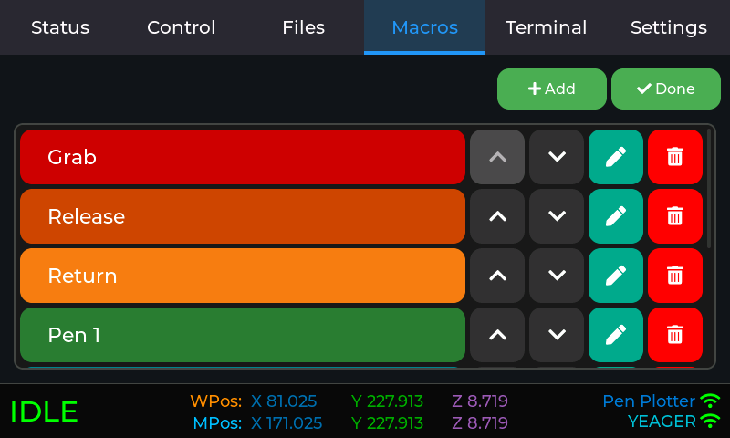

Configure all 9 macro slots simultaneously:

**Layout:**
- 3×3 grid matching normal mode layout
- Each slot shows: macro button, edit button, delete button
- "Done" button (upper right) to exit edit mode

**Per-Slot Controls:**
- **Macro Button:** Preview with current name/color
- **Edit Button:** Opens configuration dialog for that slot
- **Delete Button:** Removes macro configuration (slot becomes "Empty")

**Workflow:**
1. Tap gear icon to enter edit mode
2. Tap edit button on any slot to configure
3. Set name, select file, choose color in dialog
4. Save to apply changes
5. Tap "Done" to return to normal mode

### Macro Configuration Dialog

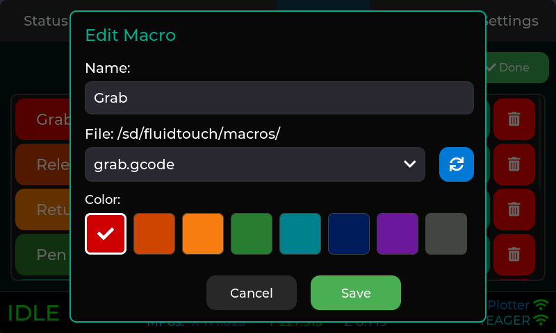

Modal dialog for configuring individual macros:

**Fields:**
- **Name:** Macro display name (shown on button)
- **File:** Dropdown of available macro files from `/sd/FluidTouch/Macros/`
- **Color:** Color picker for button background

**Buttons:**
- **Save** - Save macro configuration
- **Cancel** - Discard changes

**Notes:**
- Macro files must be placed in `/sd/FluidTouch/Macros/` directory on FluidNC
- Files should contain valid GCode commands
- Common macros: warm-up routines, homing sequences, tool changes

---

## Terminal Tab

Raw WebSocket message display:
- Live message stream from FluidNC
- Auto-scroll toggle
- Excludes messages such as status updates to prevent performance issues.

---

## Settings Tab

The Settings tab contains five sub-tabs for configuration:

### General

Machine Selection:
- Whether or not to show the machine selection screen.  If skipped, it will automatically load the configuration for the first machine.

File Browser:
- **Folders on Top:** When enabled, folders appear first in the Files tab, followed by files (both sorted alphabetically)

### Jog Settings

Jogging preferences:
- XY Max Feed Rate (mm/min)
- Z Max Feed Rate (mm/min)
- Default step sizes

### Probe Settings

Probe operation defaults:
- Feed Rate (mm/min)
- Max Distance (mm)
- Retract Distance (mm)
- Probe Thickness (mm)

### Power Settings

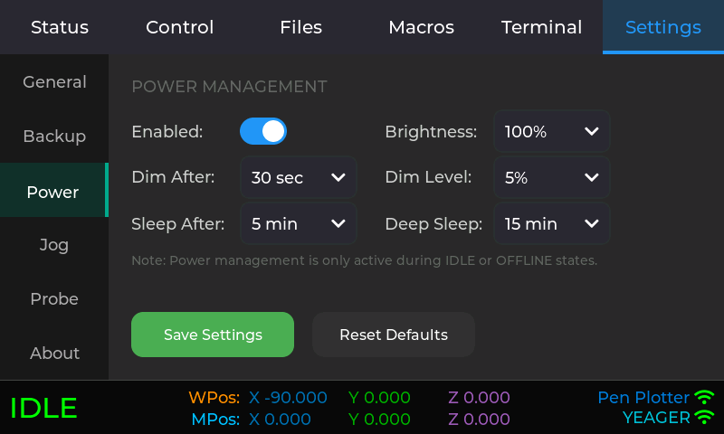

Power management and display brightness:

**Power Management:**
- **Enable/Disable:** Toggle power saving features
- **Dim Timeout:** Time until screen dims (Disabled, 15s-300s)
- **Sleep Timeout:** Time until screen off (Disabled, 60s-3600s)
- **Deep Sleep:** Time until deep sleep (Disabled, 5min-90min)

**Brightness Control:**
- **Normal Brightness:** Active display brightness (25%, 50%, 75%, 100%)
- **Dim Brightness:** Dimmed display brightness (5%, 10%, 25%, 50%)

**Notes:**
- Power saving only active during IDLE and DISCONNECTED states
- Touch activity resets timers and restores full brightness
- Deep sleep requires reset button to wake

### About

Project information:
- FluidTouch version
- GitHub link with QR code
- Screenshot server link with QR code

**GitHub QR Code:**
- Points to repository

**Screenshot Server QR Code:**
- Appears when WiFi connects
- Shows http://[IP] URL

---

## Popups & Dialogs

### System Options Popup

Appears when clicking the right side of status bar while connected:

- **Title:** System Options
- **Message:** "Restart to change machines" (or with power off note if power management enabled)
- **Buttons:**
  - Restart - Restarts ESP32 to return to machine selection
  - Power Off - Deep sleep mode (only if power management enabled)
  - Cancel - Closes dialog

### Connection Error Popups

**Machine Disconnected Popup:**

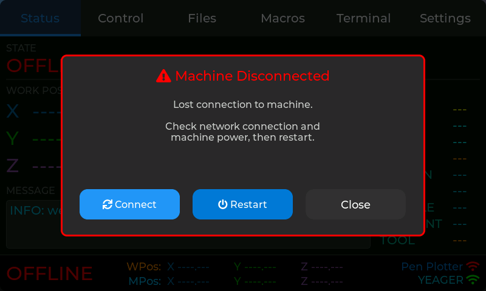

Appears when connection is lost after being previously connected:

- **Title:** Machine Disconnected
- **Message:** Shows connection details (machine name, URL, error info)
- **Buttons:**
  - Connect - Attempts to reconnect
  - Restart - Restarts ESP32
  - Close - Dismisses dialog

**Machine Connection Failed Popup:**

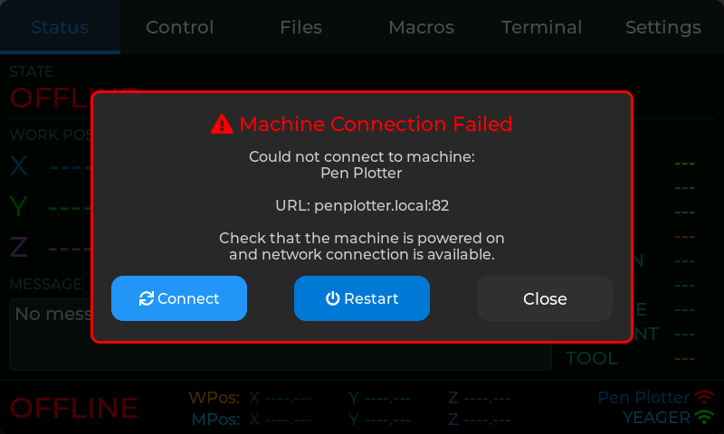

Appears when initial connection attempt fails or when clicking status bar while disconnected:

- **Title:** Connection Lost or Machine Connection Failed
- **Message:** Shows connection details and failure reason
- **Buttons:**
  - Connect - Attempts to reconnect
  - Restart - Restarts ESP32
  - Close - Dismisses dialog

### State Popups

**HOLD Popup:**

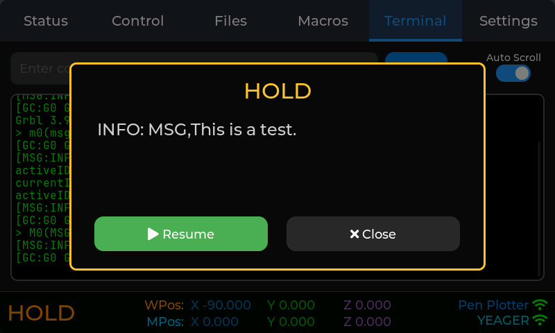

- Appears when machine enters HOLD state
- Shows last FluidNC message
- Buttons: "Close" (dismiss) and "Resume" (send cycle start)

**ALARM Popup:**

- Appears when machine enters ALARM state
- Shows alarm message
- Buttons: "Close" (dismiss) and "Clear Alarm" (reset + unlock)

---

## Navigation Tips

- **Tap status bar left** - Jump to Status tab
- **Tap status bar right** - Restart to switch machines
- **State popups** - Auto-dismiss when state changes
- **QR codes** - Scan with phone camera for quick links
- **Position displays** - Updated every 250ms from FluidNC

---

*For detailed operating instructions, see [Usage Guide](./usage.md)*
