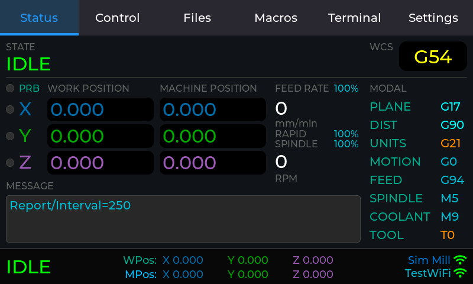

# FluidTouch Desktop Simulator

Runs the FluidTouch firmware UI on your PC in an 800×480 window, so you can
iterate on UI changes without flashing hardware. The simulator connects to a
**real FluidNC controller** over your PC's network, using the same code the
device uses.



## What's real and what's simulated

| Part | In the simulator |
|---|---|
| All UI code (`src/ui/**`), `src/main.cpp`, `PowerManager` | **Real firmware code**, compiled unchanged |
| FluidNC client (`src/network/fluidnc_client.cpp`) | **Real firmware code**. Real websocket connection to your controller |
| LVGL, ArduinoJson, ArduinoWebsockets | Same versions as `platformio.ini` |
| Display | SDL window. Backlight brightness is shown as a dark overlay |
| Touchscreen | Mouse (left button = finger) |
| Wi-Fi | Your PC's network. Wi-Fi always reports "connected" |
| mDNS (`fluidnc.local`) | Your operating system's resolver |
| Preferences (NVS) | `sim/data/preferences.json` |
| Display SD card | The folder `sim/data/sd/` |
| File upload to controller | Real HTTP upload to the controller |
| `ESP.restart()` | Relaunches the simulator |
| Deep sleep / Power Off | Closes the simulator |
| Screenshot web server | Not included. Use F12 instead |

## One-time setup (Windows)

The simulator is built with GCC and SDL2 from [MSYS2](https://www.msys2.org/),
a package manager that provides Linux-style development tools on Windows.

1. Install MSYS2. You can use the installer from msys2.org, or:
   ```powershell
   winget install --id MSYS2.MSYS2 -e
   ```
2. Install the compiler, SDL2, CMake and Ninja:
   ```powershell
   C:\msys64\usr\bin\bash.exe -lc "pacman -Sy --noconfirm --needed mingw-w64-ucrt-x86_64-gcc mingw-w64-ucrt-x86_64-SDL2 mingw-w64-ucrt-x86_64-cmake mingw-w64-ucrt-x86_64-ninja"
   ```

If MSYS2 isn't in `C:\msys64`, set `MSYS2_ROOT` or pass `-Msys2Root <path>` to
the build script.

**Linux (untested):** install `gcc g++ cmake ninja-build libsdl2-dev`, then run
the `cmake` commands shown under [Building manually](#building-manually).

## Build and run

From the repository root, in PowerShell:

```powershell
.\sim\build.ps1 -Run      # build (incremental), then launch
.\sim\build.ps1           # build only
.\sim\build.ps1 -Clean    # delete sim/build and rebuild from scratch
```

The first build downloads LVGL, ArduinoJson and ArduinoWebsockets and takes a
few minutes. Later builds only recompile the files you changed. The
executable is `sim/build/fluidtouch_sim.exe`, and the build copies the two
DLLs it needs next to it.

### First run: add your machine

1. On the Add Machine screen, enter your controller's IP address or hostname
   (for example `192.168.1.50` or `fluidnc.local`) and its websocket port:
   80 for FluidNC v4.0+, 81 for WebUI v2, 82 for WebUI v3.
2. Wi-Fi SSID and password are required by the firmware's form validation
   but are otherwise ignored. Any non-empty values work.
3. Save, then tap the machine to connect.

Machines and settings persist in `sim/data/preferences.json`, separately
from your device.

## Using the simulator

| Input | Action |
|---|---|
| Left mouse button | Touch |
| Typing (while an on-screen keyboard is open) | Types into the field that keyboard is editing. **Enter** = ✓ (OK), **Esc** = close keyboard, **Backspace**, **←/→** move the cursor |
| **F12** | Save a screenshot to `sim/data/screenshots/` |
| Typing a line in the console window | Sends it to FluidNC. This is the same serial-monitor feature as on the device |

The console shows the firmware's normal serial log. Lines prefixed with
`[SIM]` come from the simulator itself.

### Data directory

By default everything is kept in `sim/data/` (gitignored). Use a different
folder, for example to keep separate setups, with:

```powershell
.\sim\build.ps1 -Run -- --data D:\temp\ft-test
```

| Path | Purpose |
|---|---|
| `preferences.json` | Simulated NVS. Delete it to start from a factory-fresh device |
| `sd/` | The display's SD card. Put G-code files here to test **Files → Display SD** and uploads. Put `fluidtouch_settings.json` here to test settings import. Delete or rename the folder to simulate "no SD card" |
| `screenshots/` | F12 and `--script` screenshots (BMP) |

The simulated NVS applies the same rules as the ESP32. Values are stored with
their type, and reading a key back as a different type returns the default. Keys
and namespaces longer than 15 characters are rejected. Both cases print a
`[SIM] Preferences:` warning, because the same code would fail on hardware.

### Testing without a controller: fake FluidNC server

`sim/tools/fake_fluidnc.py` is a small FluidNC stand-in that uses only the
Python standard library. It handles status reports, auto-reporting, `$G`,
jogging, homing, zeroing, overrides, hold/resume and file listing.

```powershell
python sim\tools\fake_fluidnc.py --port 81              # sample file list
python sim\tools\fake_fluidnc.py --port 81 --sd D:\gcode  # serve a real folder
```

Add a machine with URL `127.0.0.1` and the same port. Windows Firewall may
ask for permission the first time. You can drive test states from the
simulator's **Terminal** tab:

| Command | Effect |
|---|---|
| `$sim/alarm=1` | Raise `ALARM:1` (enter any alarm number) |
| `$sim/msg=Hello` | Send `[MSG:Hello]` |
| `$sim/limit=XZ` | Trigger the X and Z limit pins. `$sim/limit=` clears them |
| `$sim/probe=1` | Trigger the probe pin (`0` to clear) |
| `$sim/state=Door:0` | Report any state string, e.g. `Door:0`, `Sleep`, or an unknown one to test "DISCONNECTED" |

The fake server doesn't implement uploads (HTTP) or running jobs.

### Scripted input and automated screenshots

`--script` plays back touch and keyboard input. It's useful for regenerating
documentation screenshots or quickly checking that a screen still renders. You
can pass the commands inline or as a file path:

```powershell
sim\build\fluidtouch_sim.exe --script "wait 4000; click 215 170; wait 5000; shot status.bmp; exit"
```

| Command | Meaning |
|---|---|
| `wait <ms>` | Pause |
| `click <x> <y>` | Tap (100 ms press) |
| `press <x> <y>` / `release` | Finger down / up (for press-and-hold or drags) |
| `type <text>` | Type into the field the on-screen keyboard is editing |
| `key <enter\|esc\|backspace\|left\|right>` | Special keys |
| `shot [file.bmp]` | Screenshot. Relative names go to `<data>/screenshots/` |
| `exit` | Quit |

Coordinates are screen pixels (0–799, 0–479). Add a short `wait` after actions
that animate, such as tab switches or the keyboard closing and the dialog
scrolling back, or the next click may land on the wrong spot. `#` starts a
comment in script files. Restarts drop the script so it isn't replayed.

## Limitations: still check these on hardware

- **Performance.** A PC is far faster than the ESP32-S3 and doesn't use PSRAM
  timing. Slow redraws or large lists won't show up here. The LVGL memory
  pool *is* the same size (1 MB, from `lv_conf.h`), so running out of LVGL
  memory will reproduce.
- **Touch feel.** Mouse precision and the GT911 touchscreen feel different,
  so check small targets and drag gestures on the device.
- **Display.** Colors and viewing angles differ, especially on the Basic's TN panel.
  Display rotation (180°) is saved but not applied to the window.
- **Wi-Fi.** It's always "connected", so the Wi-Fi-failure dialogs can't be
  triggered. Controller disconnects can be tested by stopping the
  controller or the fake server.
- **Blocking behaviour.** `delay()` keeps the window responsive, but the
  firmware's blocking waits (for example the connect retries) take real time,
  just like on the device.
- **Heap and PSRAM numbers** printed in the log are fixed placeholder values.
- The screenshot web server and the hardware-specific parts of the display,
  touch and backlight drivers aren't compiled.

## How it works

The simulator is a separate CMake project in `sim/` that compiles the
firmware's own sources together with a thin desktop platform layer:

```
sim/
├── CMakeLists.txt        builds lvgl + ArduinoWebsockets + src/** + sim/src/**
├── build.ps1             Windows build/run helper (uses MSYS2 UCRT64)
├── include/              desktop versions of Arduino/ESP32 headers (searched BEFORE include/)
│   ├── Arduino.h, WString.h, Print.h, IPAddress.h   Arduino core subset
│   ├── Preferences.h, FS.h, SD.h, SPI.h, Wire.h     storage / buses
│   ├── WiFi.h, WiFiClient.h, ESPmDNS.h, HTTPClient.h networking
│   ├── esp_heap_caps.h, esp_sleep.h                 ESP-IDF bits
│   ├── core/display_driver.h                        SDL version of the display driver API
│   ├── lv_conf.h                                    wraps ../../include/lv_conf.h, turns on SDL
│   └── sim_ws_platform.h                            desktop TCP client for ArduinoWebsockets
├── src/                  implementations of the above + sim_main.cpp (main(), scripts, F12)
└── tools/fake_fluidnc.py
```

Key points:

- **Firmware sources are compiled unchanged.** Every `src/**/*.cpp` is
  included except the three hardware-only files `src/core/display_driver.cpp`,
  `src/core/touch_driver.cpp` and `src/network/screenshot_server.cpp`, which
  have replacements in `sim/src/`. `sim_main.cpp` provides `main()` and calls
  the firmware's `setup()` once and then `loop()` forever, just like the Arduino core.
- **Header shadowing.** `sim/include` comes before `include/` on the include
  path, so `#include <Arduino.h>`, `<Preferences.h>`, `"core/display_driver.h"`
  and the others resolve to the desktop versions.
- **Websockets.** ArduinoWebsockets only selects a TCP backend for ESP and
  Teensy boards, so `sim_ws_platform.h` is force-included (`gcc -include`)
  into every C++ file and supplies `WSDefaultTcpClient`, backed by
  Winsock/BSD sockets in `sim/src/net.cpp`.
- **`-funsigned-char`** matches the ESP32 (Xtensa) compiler, where `char` is
  unsigned. The firmware relies on this, for example for FluidNC's realtime
  command bytes.

## Maintaining the simulator

- **The firmware starts using a new Arduino/ESP32 API.** The simulator build
  will fail with an undeclared identifier. Add the missing function to the
  matching header in `sim/include/`, implemented in `sim/src/` if it needs
  real behaviour. Keep each addition small: a no-op is fine for hardware-only
  calls.
- **A new hardware-only source file** (a new driver, for example) needs a
  desktop replacement in `sim/src/`, or it must be excluded with a
  `list(FILTER ...)` line in `sim/CMakeLists.txt`.
- **Library upgrades.** When bumping LVGL, ArduinoJson or ArduinoWebsockets in
  `platformio.ini`, update the matching `GIT_TAG` in `sim/CMakeLists.txt`, then
  rebuild with `-Clean`.
- **`lv_conf.h` changes** apply to both builds automatically. Only SDL settings
  live in `sim/include/lv_conf.h`.

### Building manually

```bash
# from an MSYS2 UCRT64 shell, or with C:\msys64\ucrt64\bin first on PATH
cmake -S sim -B sim/build -G Ninja -DCMAKE_BUILD_TYPE=Debug
cmake --build sim/build
sim/build/fluidtouch_sim --help
```

`sim/build/compile_commands.json` is generated for clangd/IntelliSense.

## Troubleshooting

| Problem | Fix |
|---|---|
| `MSYS2 UCRT64 gcc not found` | Install MSYS2 and the packages above, or point `-Msys2Root` at your install |
| Exe exits immediately with code 127, or "DLL not found" | Run from `sim/build/`, where the build copies `SDL2.dll` and `libwinpthread-1.dll`. Rebuild if they're missing |
| CMake picks up a different gcc (Cygwin, Strawberry Perl, …) | Use `build.ps1`, which puts MSYS2 first on `PATH`, or run `.\sim\build.ps1 -Clean` |
| `fluidnc.local` doesn't resolve | Check `ping fluidnc.local` from the same PC. If that fails too, use the IP address |
| "Connection failed" | Check the port (80/81/82 depends on the FluidNC version) and that the PC can reach the controller |
| UI looks stale after pulling changes | `.\sim\build.ps1 -Clean` |
